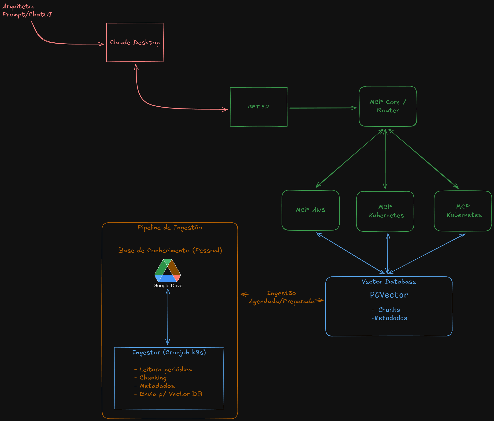

# MCP Platform – Arquitetura Cloud & DevOps

Plataforma MCP para suporte a Arquitetura Cloud, Multicloud, DevOps e FinOps,
utilizando GPT-5.2, Kubernetes e base de conhecimento estruturada.

## Visão geral
- MCP Core / Router
- MCPs especializados por domínio
- Pipeline de ingestão de conhecimento
- Vector Database (PGVector)
- Execução em Kubernetes

## Princípios
- Read-only por padrão
- Separação de responsabilidades
- Automação consciente
- Custos como decisão arquitetural

